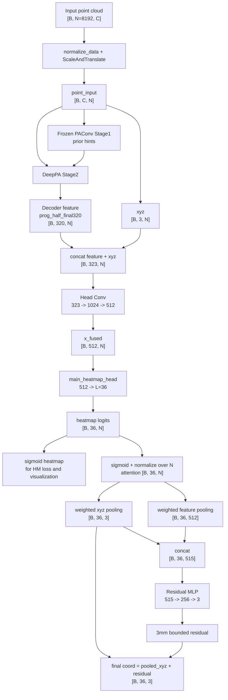

# PA163 1.43 모델 총정리: HMAttnResidual Sigmoid Pool

작성일: 2026-05-14

이 문서는 NotebookLM이나 다른 LLM에 넣어도 현재 1.43 mm 모델의 구조, 실행 세팅, 코드 흐름, 평가 방식을 이해할 수 있도록 정리한 총정리 문서다.

핵심 기준 모델은 아래 실험이다.

```text
exp_name : S2G_Frozen_HMAttnResidual_SigmoidPool500
user_tag : pa163_hmattnres3mm_sigmoidpool_auxdrop30_trainhmplateau_topkcurv_500
result   : ME 1.4317 +/- 0.8755 mm
```

결과 파일:

```text
C:\Users\CGlab\Desktop\Earlandmark\results\S2G_Frozen_HMAttnResidual_SigmoidPool500\FPS8192_sigma2.5_batch4_train200_pa163_hmattnres3mm_sigmoidpool_auxdrop30_trainhmplateau_topkcurv_500_Stage2_RAW_AuxDrop30_1\frozen_aux_drop_Results_ME1.4317.txt
```

주의할 점:

```text
이 1.43 모델은 "softmax heatmap 모델"이 아니다.
현재 코드 기준 핵심 readout은 sigmoid(logits)를 만든 뒤 point 축으로 합이 1이 되도록 나누는 sigmoid-normalized attention pooling이다.
```

즉, 이 모델은 다음 구조로 보는 것이 정확하다.

```text
Frozen PAConv prior
+ DeepPA prog_half_final320 decoder
+ sigmoid heatmap supervision
+ sigmoid-normalized heatmap attention pooling
+ xyz pooling + 512ch feature pooling
+ 3mm bounded residual coordinate MLP
+ train-HM plateau 이후 coord/surface/struct geometry loss
```

---

## 1. 실험 한 줄 요약

이 모델은 heatmap을 단순히 top-k로만 좌표화하지 않는다.

먼저 DeepPA head가 landmark별 heatmap logits를 만든다. 그 logits에 sigmoid를 적용해서 landmark별로 8192개 point에 대한 confidence map을 만들고, 이를 point 축으로 정규화해서 attention weight로 사용한다. 같은 attention으로 원래 xyz 좌표와 512차원 point feature를 각각 weighted average pooling한다. 그 뒤 pooled xyz와 pooled feature를 concat해서 residual MLP에 넣고, MLP가 예측한 작은 보정량을 pooled xyz에 더해서 최종 landmark 좌표를 만든다.

따라서 coordinate loss, surface loss, structural loss는 단순 hard top-k 좌표가 아니라 아래 좌표에 걸린다.

```text
final_coord = pooled_xyz + residual_mlp([pooled_feature, pooled_xyz])
```

여기서 residual은 최대 3 mm로 제한된다.

---

## 2. 재현 명령어

큐 파일:

```text
debug_outputs\pa163_hmattnres3mm_sigmoidpool_auxdrop30_trainhmplateau_topkcurv_500_20260513_queue.json
```

큐 설명:

```text
PA163 Frozen DeepPA HMAttnResidual run matching the hard top-k curvature baseline,
but with sigmoid-normalized all-point heatmap attention pooling in DeepPA_model.py.
```

실제 실행 명령:

```powershell
C:\Users\CGlab\anaconda3\envs\EarLandMarking_DeepLA\python.exe run_frozen.py `
  --user_tag pa163_hmattnres3mm_sigmoidpool_auxdrop30_trainhmplateau_topkcurv_500 `
  --exp_name S2G_Frozen_HMAttnResidual_SigmoidPool500 `
  --need_resample False `
  --stage1_exp_name S2G_PAconv_Refinement `
  --stage1_user_tag finetune_paconv_heatmap `
  --train_dataset_name train `
  --val_dataset_name valiation `
  --test_dataset_name test `
  --val_partition val `
  --Eval_DataType test `
  --epochs 500 `
  --train_len 200 `
  --batch_size 4 `
  --num_points 8192 `
  --geom_batch_size 16 `
  --fusion_residual_base prior `
  --ablation_only frozen_aux_drop `
  --aux_drop_epochs 30 `
  --use_stagewise_aux_hm True `
  --decoder_fusion prog_half_final320 `
  --train_coord_readout heatmap_attn_residual `
  --hm_attn_residual_max_mm 3.0 `
  --coord_loss_mode focal_l1 `
  --struct_loss_mode coord `
  --surface_loss_mode topk `
  --loss_schedule train_hm_plateau `
  --plateau_start_epoch 30 `
  --plateau_window 20 `
  --plateau_patience 10 `
  --plateau_threshold 0.01 `
  --plateau_transition_epochs 1 `
  --plateau_transition_mode linear `
  --fixed_main_weight 1.0 `
  --fixed_geom_weight 1.0
```

명령어에 명시되지 않았지만 중요한 기본값:

```text
heatmap_activation_mode = sigmoid
heatmap_loss_mode      = adaptive_wing
latent_injection_type  = raw
regression_point_num   = 기본값 유지
```

현재 코드에서 더 중요한 사실:

```text
DeepPA_model.py의 forward는 main_heatmap = torch.sigmoid(main_heatmap_logits)를 직접 사용한다.
따라서 이 1.43 모델의 DeepPA heatmap output은 sigmoid 기반이다.
```

---

## 3. 결과 요약

최종 평가:

```text
Average ME        : 1.4317 mm
Average Std       : 0.8755 mm
95%ile ME         : 1.8638 mm
SR < 10 mm        : 100.00 %
SR < 5 mm         : 100.00 %
Heatmap cosine    : 69.90 %
Heatmap mIoU @0.1 : 25.85 %
```

어려운 landmark:

```text
LM35 : 4.067 +/- 1.863 mm
LM02 : 3.907 +/- 2.755 mm
LM34 : 3.184 +/- 1.527 mm
LM01 : 3.020 +/- 1.860 mm
LM05 : 2.356 +/- 1.521 mm
```

중요 비교 결과:

```text
HMAttnResidual feature+xyz 3mm clamp : 1.4317 +/- 0.8755
HMAttnResidual feature-only 3mm      : 1.4376 +/- 0.8588
Immediate geometry same readout      : 1.4428 +/- 0.8596
prog320 + top-k readout              : 1.4796 +/- 0.8588
prog320 + sigmoid xyz pool only      : 1.4595 +/- 0.9520
hard top-k sigmoid baseline          : 1.4596 +/- 0.8834
soft-local curvature run             : 1.5119 +/- 0.9153
```

해석:

```text
1. decoder를 prog_half_final320으로 바꾼 것만으로는 1.43까지 내려가지 않았다.
2. sigmoid xyz pooling만으로도 hard top-k baseline 근처까지 오지만 1.43은 아니다.
3. 512ch pooled feature를 residual MLP에 넣는 HMAttnResidual이 핵심 개선으로 보인다.
4. feature-only residual도 1.4376이라 매우 강하지만, pooled_xyz까지 residual 입력에 넣은 515ch 모델이 약간 더 좋았다.
5. soft-local curvature는 이 실험군에서는 오히려 악화됐다.
```

---

## 4. 전체 파이프라인

실행 흐름:

```text
run_experiment_queue.py
  -> run_frozen.py
      -> train.py
          -> UniversalPipeline(mode="frozen")
              -> Stage 1 PAConv
                 - pretrained heatmap PAConv
                 - frozen 상태
                 - DeepPA에 prior hints 제공
              -> Stage 2 DeepPA_Wrapper
                 - DeepPA backbone/decoder
                 - prog_half_final320 decoder fusion
                 - 323 -> 1024 -> 512 head
                 - landmark heatmap logits
                 - sigmoid-normalized attention pooling
                 - residual coordinate MLP
          -> loss.py
              -> AdaptiveWing heatmap loss
              -> focal_l1 coordinate loss
              -> CurvatureSurfaceLoss
              -> structural pairwise coordinate loss
          -> loss_controller.py
              -> AuxDrop30
              -> train-HM plateau schedule
      -> eval.py
          -> same readout as training
          -> ME/STD export
```

Mermaid 구조:



---

## 5. Tensor shape 기준

기호:

```text
B = batch size, 현재 4
N = point number, 현재 8192
L = landmark 수, 현재 36
C = input channel 수
F = head feature channel, 현재 512
```

DataLoader 출력:

```text
point    : [B, N, C]
landmark : [B, L, 3]
seg      : [B, N, L]
```

train.py에서 변환:

```python
point_normal, landmark_normal = normalize_data(point, landmark)
point_normal, augmented_landmark = ScaleAndTranslate(point_normal, landmark_normal)
point_input = point_normal.permute(0, 2, 1).contiguous()
target_hm = seg.permute(0, 2, 1).contiguous()
```

shape:

```text
point_input        : [B, C, N]
augmented_landmark : [B, L, 3]
target_hm          : [B, L, N]
```

DeepPA_model.py 내부:

```text
xyz_coords         : [B, N, 3]
dense_features     : [B, 320, N]
fused_features     : [B, 323, N]
x_fused            : [B, 512, N]
main_heatmap_logits: [B, 36, N]
main_heatmap       : [B, 36, N]
```

HMAttnResidual readout:

```text
attention      : [B, 36, N]
pooled_xyz     : [B, 36, 3]
pooled_feature : [B, 36, 512]
residual_input : [B, 36, 515]
residual       : [B, 36, 3]
final_coords   : [B, 36, 3]
```

8192 point 차원은 어디로 가는가:

```text
[B, 36, 8192] @ [B, 8192, 3]   -> [B, 36, 3]
[B, 36, 8192] @ [B, 8192, 512] -> [B, 36, 512]
```

여기서 8192는 matrix multiplication의 안쪽 차원이므로 weighted sum 과정에서 합산되어 사라진다. 즉, 각 landmark마다 8192개 point 정보를 하나의 pooled xyz와 하나의 pooled feature로 요약한다.

---

## 6. 핵심 코드 주석: DeepPA_model.py

관련 파일:

```text
DeepPA_model.py
```

### 6.1 residual MLP 정의

실제 코드 개념:

```python
self.coord_residual_mlp = nn.Sequential(
    nn.Linear(512 + 3, 256),
    nn.ReLU(inplace=True),
    nn.Dropout(0.1),
    nn.Linear(256, 3)
)
```

주석:

```text
입력 515 = pooled_feature 512ch + pooled_xyz 3ch
출력 3 = x, y, z 방향 residual correction
```

왜 512와 xyz를 같이 넣는가:

```text
pooled_feature는 attention이 모은 주변 feature context다.
pooled_xyz는 같은 attention이 만든 현재 base coordinate다.
MLP는 "현재 어디를 보고 있는지"와 "그 주변 feature가 무엇인지"를 함께 보고 작은 보정량을 예측한다.
```

feature-only ablation:

```text
heatmap_attn_residual_feature_only는 residual MLP 입력으로 pooled_feature 512ch만 쓴다.
하지만 최종 좌표는 여전히 pooled_xyz + residual이다.
결과가 1.4376이므로 feature만으로도 강하지만, pooled_xyz까지 residual 입력에 넣은 515ch 모델이 1.4317로 조금 더 좋았다.
```

### 6.2 sigmoid xyz pooling

실제 코드:

```python
def _heatmap_sigmoid_xyz_pool_coords(self, xyz_coords, heatmap_logits):
    attention = torch.sigmoid(heatmap_logits)
    attention = attention / (attention.sum(dim=2, keepdim=True) + 1e-6)
    return torch.bmm(attention, xyz_coords)
```

주석:

```text
1. heatmap_logits [B, L, N]에 sigmoid를 적용한다.
2. point 축 N에 대해 합이 1이 되도록 나눈다.
3. attention [B, L, N]과 xyz [B, N, 3]을 bmm한다.
4. 결과는 landmark별 weighted-average coordinate [B, L, 3]이다.
```

수식:

```text
w_l,i = sigmoid(z_l,i)
a_l,i = w_l,i / sum_j w_l,j
coord_l = sum_i a_l,i * xyz_i
```

의미:

```text
top-k처럼 K개 point만 고르는 것이 아니라 모든 8192개 point를 confidence 비율에 따라 사용한다.
```

### 6.3 HMAttnResidual coordinate readout

실제 코드:

```python
def _heatmap_attention_residual_coords(self, xyz_coords, point_features, heatmap_logits):
    attention = torch.sigmoid(heatmap_logits)
    attention = attention / (attention.sum(dim=2, keepdim=True) + 1e-6)

    pooled_xyz = torch.bmm(attention, xyz_coords)
    pooled_feature = torch.bmm(attention, point_features.transpose(1, 2).contiguous())
    residual_input = torch.cat([pooled_feature, pooled_xyz], dim=2)

    B, L, _ = residual_input.shape
    residual = self.coord_residual_mlp(residual_input.view(B * L, -1)).view(B, L, 3)

    limit = self.current_residual_limit_norm
    if limit is None:
        limit = float(getattr(self.args, 'hm_attn_residual_max_norm', 0.0))
    if limit and limit > 0.0:
        residual = float(limit) * torch.tanh(residual)

    return pooled_xyz + residual
```

주석:

```text
attention:
  heatmap logits를 sigmoid confidence로 바꾼 뒤 point 축으로 정규화한다.

pooled_xyz:
  heatmap attention으로 8192개 xyz를 landmark별 1개 좌표로 압축한다.

pooled_feature:
  같은 attention으로 8192개 512ch feature를 landmark별 1개 512ch feature로 압축한다.

residual_input:
  pooled_feature와 pooled_xyz를 붙인다.
  shape은 [B, 36, 515]다.

residual MLP:
  각 landmark를 독립 샘플처럼 펴서 [B*36, 515]로 넣고,
  515 -> 256 -> 3 변환으로 residual xyz 보정량을 만든다.

3mm clamp:
  tanh를 통해 residual을 [-limit, +limit] 범위로 제한한다.

final:
  pooled_xyz를 base coordinate로 두고 residual을 더한다.
```

중요 해석:

```text
이 구조는 coordinate branch가 heatmap 뒤에 별도로 거대한 direct regression head를 붙인 것이 아니다.
heatmap이 만든 attention을 반드시 통과해야 좌표가 나오기 때문에, coordinate loss와 geometry loss가 heatmap logits에도 영향을 준다.
```

---

## 7. 핵심 코드 주석: train.py

관련 파일:

```text
train.py
```

### 7.1 residual 3mm 제한을 normalized coordinate로 바꾸는 부분

실제 코드 개념:

```python
point_xyz = point[:, :, :3]
avg_m = torch.mean(torch.max(torch.sqrt(torch.sum(
    (point_xyz - torch.mean(point_xyz, axis=1, keepdim=True)) ** 2,
    axis=2
)), axis=1)[0]).item()

if args.train_coord_readout in ['heatmap_attn_residual', 'heatmap_attn_residual_feature_only']:
    residual_max_mm = float(args.hm_attn_residual_max_mm)
    if residual_max_mm > 0.0:
        model.set_residual_limit_norm(residual_max_mm / max(float(avg_m), 1e-6))
```

주석:

```text
모델 내부 좌표는 normalized coordinate다.
사용자는 hm_attn_residual_max_mm=3.0처럼 mm 단위 제한을 넣는다.
따라서 batch별 point cloud scale인 avg_m으로 나누어 normalized coordinate 제한값으로 바꾼다.
```

해석:

```text
residual limit norm = 3.0 mm / 현재 batch point cloud scale
```

교수님께 설명할 때:

```text
3mm 제한은 normalized 공간에서 직접 3을 넣는 것이 아니라,
각 batch의 point cloud physical scale을 이용해서 normalized unit으로 환산한 뒤 tanh clamp로 적용합니다.
```

### 7.2 geometry loss가 어떤 좌표에 걸리는가

실제 코드:

```python
pred_coords, sem_list, paconv_hm = model(point_input)
L_crd = focal_l1_loss(pred_coords, augmented_landmark, gamma=args.focal_gamma)
L_srf, _, _, _ = surface_criterion(pred_coords, augmented_landmark, points_for_coords, disable_norm=False)
L_str = compute_structural_loss(pred_coords, augmented_landmark)
```

주석:

```text
pred_coords는 HMAttnResidual readout 결과다.
즉 geometry loss는 hard top-k 좌표가 아니라 pooled_xyz + residual 좌표에 걸린다.
```

결과:

```text
coordinate loss
surface/curvature loss
structural loss

모두 HMAttnResidual 좌표를 직접 압박한다.
```

---

## 8. 핵심 코드 주석: eval.py

관련 파일:

```text
eval.py
```

### 8.1 평가 때도 학습과 같은 readout을 쓰는 부분

실제 코드:

```python
def _coords_from_main_heatmap(self, points_xyz, sem_list, fallback_coords=None):
    if sem_list:
        readout_mode = getattr(self.args, 'train_coord_readout', 'topk').lower()
        if readout_mode in ['sigmoid_xyz_pool',
                            'heatmap_attn_residual',
                            'heatmap_attn_residual_feature_only'] and fallback_coords is not None:
            return fallback_coords
        k_val = getattr(self.args, 'regression_point_num', 10)
        return get_differentiable_coords(points_xyz, sem_list[-1], k=k_val)
    return fallback_coords
```

주석:

```text
readout_mode가 heatmap_attn_residual이면 eval.py가 sem_list에서 다시 hard top-k를 뽑지 않는다.
모델 forward가 이미 만든 fallback_coords를 그대로 쓴다.
```

왜 중요한가:

```text
HMAttnResidual 모델을 hard top-k로 평가하면 학습 때 사용한 residual coordinate MLP를 평가에서 버리는 셈이 된다.
따라서 HMAttnResidual 모델은 평가도 train_coord_readout heatmap_attn_residual로 맞춰야 한다.
```

### 8.2 1.43 평가 명령어

실제 기록:

```powershell
C:\Users\CGlab\anaconda3\envs\EarLandMarking_DeepLA\python.exe eval.py `
  --exp_name S2G_Frozen_HMAttnResidual_SigmoidPool500 `
  --stage1_exp_name S2G_PAconv_Refinement `
  --stage1_user_tag finetune_paconv_heatmap `
  --train_dataset_name train `
  --val_dataset_name valiation `
  --test_dataset_name test `
  --val_partition val `
  --Eval_DataType test `
  --epochs 500 `
  --train_len 200 `
  --batch_size 4 `
  --num_points 8192 `
  --geom_batch_size 16 `
  --fusion_residual_base prior `
  --ablation_only frozen_aux_drop `
  --aux_drop_epochs 30 `
  --use_stagewise_aux_hm True `
  --decoder_fusion prog_half_final320 `
  --train_coord_readout heatmap_attn_residual `
  --hm_attn_residual_max_mm 3.0 `
  --coord_loss_mode focal_l1 `
  --struct_loss_mode coord `
  --surface_loss_mode topk `
  --loss_schedule train_hm_plateau `
  --plateau_start_epoch 30 `
  --plateau_window 20 `
  --plateau_patience 10 `
  --plateau_threshold 0.01 `
  --plateau_transition_epochs 1 `
  --plateau_transition_mode linear `
  --fixed_main_weight 1.0 `
  --fixed_geom_weight 1.0 `
  --need_resample False `
  --model frozen_aux_drop `
  --run_id 1 `
  --model_epoch Frozen_Aux_Drop_last.t7 `
  --user_tag pa163_hmattnres3mm_sigmoidpool_auxdrop30_trainhmplateau_topkcurv_500_Stage2_RAW_AuxDrop30 `
  --latent_injection_type raw
```

현재 eval.py에는 이후 commit에서 surface diagnostics가 추가되어 있다.
기존 1.4317 결과 파일은 추가 전 평가라 surface diagnostics가 없을 수 있다. 현재 eval.py로 다시 평가하면 ME/STD 계산을 바꾸지 않고 아래 항목이 추가된다.

```text
Surface Loss Mode
Surface Loss (norm)
Surface Normal Distance (mm)
Surface Curvature Diff
Surface Direction Diff
```

---

## 9. 핵심 코드 주석: deeppa_semseg.py

관련 파일:

```text
deeppa_semseg.py
```

### 9.1 prog_half_final320 decoder fusion

실제 코드 개념:

```python
def get_decoder_out_dim(args, depth):
    mode = args.decoder_fusion
    dims = [64, 128, 256, 512]
    if mode == 'prog_half_final320':
        out_dim = dims[-1]
        for d in range(len(dims) - 2, depth - 1, -1):
            merged_dim = out_dim + dims[d]
            out_dim = merged_dim if d == 0 else merged_dim // 2
        return out_dim
```

depth 0 기준 계산:

```text
512 + 256 = 768 -> half -> 384
384 + 128 = 512 -> half -> 256
256 + 64  = 320 -> final -> 320
```

따라서 최종 decoder feature channel은 320이다.

```text
decoder output : [B, 320, N]
xyz            : [B, 3, N]
head input     : [B, 323, N]
```

해석:

```text
기존 add 방식은 decoder stage들을 단순히 더해서 head_dim 256 근처로 맞추는 쪽이다.
prog_half_final320은 multi-scale feature를 concat한 뒤 중간 단계에서 half compression을 걸어 최종 320ch를 만든다.
이 덕분에 단순 add보다 더 많은 decoder context를 head에 넘길 수 있다.
```

다만 ablation 결과상 decoder만 바꾼 top-k 모델은 1.4796이므로, 1.4317의 핵심 원인은 decoder 단독이라기보다 decoder + HMAttnResidual readout 조합으로 보는 것이 맞다.

---

## 10. 핵심 코드 주석: loss_controller.py

관련 파일:

```text
loss_controller.py
```

### 10.1 AuxDrop30

실제 코드:

```python
elif m_name == 'frozen_aux_drop':
    w_hds = max(0.0, 1.0 - (1.0 * (epoch / float(self.aux_drop_epochs))))
    total_loss = (w_main * L_main) + (w_hds * L_aux) + (w_geom * L_pred) + frozen_pa_loss
```

현재 설정:

```text
aux_drop_epochs = 30
```

의미:

```text
초기에는 aux heatmap supervision을 강하게 쓰고,
30 epoch 동안 선형으로 줄여서 이후에는 main head 중심으로 학습한다.
```

### 10.2 train_hm_plateau

실제 코드 개념:

```python
if loss_schedule == 'train_hm_plateau':
    if ramp_start_epoch is None or epoch < ramp_start_epoch:
        w_main = 1.0
        w_geom = 0.0
    else:
        transition_progress = ...
        w_main = 1.0 + (final_main_weight - 1.0) * transition_progress
        w_geom = final_geom_weight * transition_progress
```

현재 설정:

```text
plateau_start_epoch      = 30
plateau_window           = 20
plateau_patience         = 10
plateau_threshold        = 0.01
plateau_transition_epochs= 1
fixed_main_weight        = 1.0
fixed_geom_weight        = 1.0
```

의미:

```text
초기에는 heatmap loss만으로 heatmap 분포를 안정화한다.
train main heatmap loss가 더 이상 충분히 개선되지 않는 plateau 상태가 되면 geometry loss를 켠다.
transition_epochs=1이므로 geometry가 켜진 뒤에는 거의 즉시 Main_W=1, Geom_W=1이 된다.
```

최종 geometry loss 묶음:

```text
L_pred = L_crd + L_srf + L_str
```

---

## 11. Loss 구성

현재 활성 loss:

```text
L_main_hm : main sigmoid heatmap vs GT heatmap
L_aux_hm  : stage-wise aux heatmap vs GT heatmap
L_crd     : focal_l1(pred_coords, GT coords)
L_srf     : CurvatureSurfaceLoss, surface_loss_mode topk
L_str     : pairwise coordinate structural loss
```

### 11.1 Heatmap loss

현재 기본값:

```text
heatmap_loss_mode = adaptive_wing
```

코드:

```python
hm_criterion = AdaptiveWingLoss()
L_main_hm, L_aux_hm = hierarchical_hm_loss(sem_list, target_hm, stage_hm_indices)
```

의미:

```text
GT heatmap과 predicted sigmoid heatmap의 dense regression loss다.
좌표 오차를 직접 계산하는 것이 아니라, landmark별 point confidence map을 맞추는 loss다.
```

### 11.2 Coordinate loss

현재 설정:

```text
coord_loss_mode = focal_l1
```

코드:

```python
L_crd = focal_l1_loss(pred_coords, augmented_landmark, gamma=args.focal_gamma)
```

의미:

```text
pred_coords는 HMAttnResidual 좌표다.
따라서 coordinate loss는 heatmap attention pooling과 residual MLP 둘 다에 gradient를 준다.
```

### 11.3 Structure loss

현재 설정:

```text
struct_loss_mode = coord
```

코드:

```python
pred_dist_matrix = torch.cdist(pred_coords, pred_coords)
gt_dist_matrix = torch.cdist(gt_coords, gt_coords)
L_str = L1(pred_dist_matrix, gt_dist_matrix)
```

의미:

```text
각 landmark를 개별 점으로만 맞추는 것이 아니라 landmark 간 거리 관계를 맞춘다.
귀 landmark 전체 모양이 무너지지 않도록 압박한다.
```

### 11.4 Surface/curvature loss

현재 설정:

```text
surface_loss_mode = topk
```

의미:

```text
predicted landmark가 point cloud 표면 위에 놓이도록 하고,
주변 표면 curvature와 방향성도 GT 주변과 비슷하게 만든다.
```

주의:

```text
top-k/KNN 선택 자체는 discrete selection이어서 full heatmap 분포 전체에 부드럽게 gradient를 주는 방식은 아니다.
하지만 선택된 patch 안에서는 pred_coords에 대해 gradient가 흐른다.
학술적으로는 "piecewise differentiable with sparse or selection-limited gradient support"라고 표현하는 것이 적절하다.
```

---

## 12. 평가 방식 정리

### 12.1 pure heatmap/top-k 모델

만약 train_coord_readout이 topk이면:

```text
heatmap -> top-k weighted coordinate -> ME
```

평가도 top-k로 하는 것이 맞다.

### 12.2 sigmoid_xyz_pool 모델

만약 train_coord_readout이 sigmoid_xyz_pool이면:

```text
heatmap logits -> sigmoid -> normalize -> xyz weighted pooling -> coordinate -> ME
```

평가도 sigmoid_xyz_pool로 해야 한다.

### 12.3 HMAttnResidual 모델

현재 1.43 모델:

```text
heatmap logits
  -> sigmoid-normalized attention
  -> xyz pooling + 512ch feature pooling
  -> residual MLP
  -> pooled_xyz + residual
  -> ME
```

평가도 HMAttnResidual로 해야 한다.

잘못된 평가:

```text
HMAttnResidual로 학습한 모델을 평가 때 hard top-k로 좌표를 뽑으면,
학습된 residual coordinate MLP를 버리고 heatmap만 평가하는 것이 된다.
```

따라서 비교표에는 반드시 아래를 적어야 한다.

```text
Evaluation readout: same as training readout
```

---

## 13. 왜 1.43까지 좋아졌는가

현재 결과를 기준으로 가능한 해석:

### 13.1 top-k보다 gradient 영향 범위가 넓다

hard top-k:

```text
상위 K개 point만 좌표에 직접 들어간다.
선택되지 않은 point는 coordinate readout에 직접 영향이 약하다.
```

sigmoid-normalized attention:

```text
8192개 point 전체가 attention weight를 통해 weighted average에 참여한다.
따라서 coordinate loss와 geometry loss가 heatmap logits 분포를 더 넓게 조정할 수 있다.
```

### 13.2 512ch pooled feature가 좌표 보정 정보를 제공한다

pooled_xyz만 쓰면:

```text
어디를 봤는지는 알지만 주변 feature context는 직접 사용하지 않는다.
```

pooled_feature까지 쓰면:

```text
그 위치 주변의 512ch semantic/geometric feature 정보를 보고 residual correction을 예측할 수 있다.
```

feature-only residual 결과가 1.4376이고 feature+xyz 결과가 1.4317인 점을 보면:

```text
512ch feature pooling이 핵심이고, pooled_xyz를 residual input에 같이 넣는 것이 작은 추가 이득을 준다.
```

### 13.3 3mm clamp가 direct regression 폭주를 막는다

residual MLP를 제한 없이 쓰면:

```text
heatmap attention이 만든 base coordinate를 무시하고 MLP가 direct regression처럼 행동할 수 있다.
```

3mm 제한을 걸면:

```text
최종 좌표는 반드시 heatmap attention이 만든 pooled_xyz 근처에 있어야 한다.
즉 heatmap 기반성을 유지하면서 작은 보정만 허용한다.
```

### 13.4 train_hm_plateau schedule이 heatmap 안정화 후 geometry를 켠다

초기부터 geometry를 강하게 켜면:

```text
heatmap 분포가 아직 불안정한 상태에서 coordinate/surface/struct loss가 섞여 학습이 흔들릴 수 있다.
```

현재 schedule:

```text
먼저 heatmap을 안정화한다.
그 뒤 train main heatmap loss plateau를 감지하면 geometry loss를 켠다.
```

---

## 14. softmax 실험과의 구분

현재 1.43 모델은 softmax heatmap 모델이 아니다.

정확한 표현:

```text
Heatmap output/supervision:
  sigmoid heatmap + AdaptiveWing loss

Coordinate attention:
  sigmoid(logits) followed by sum-normalization over points
```

즉 softmax와 다른 점:

```text
softmax는 exp(logit) 기반이라 가장 큰 logit에 확률이 강하게 몰릴 수 있다.
sigmoid-normalized attention은 각 point의 독립 confidence를 먼저 만들고, 이후 전체 합으로만 정규화한다.
따라서 여러 후보 point가 동시에 살아남기 쉽다.
```

이 때문에 교수님께 설명할 때는 아래처럼 말하는 것이 안전하다.

```text
소프트맥스가 아니라 sigmoid confidence map을 만든 뒤 정규화한 dense attention pooling입니다.
전체 point를 대상으로 weighted average를 하기 때문에 top-k보다 분포 전체에 영향을 줄 수 있고,
softmax보다 신호가 한 점에 과도하게 몰리는 것을 줄일 수 있습니다.
```

---

## 15. 그림 수정 제안

논문 그림에서는 아래처럼 표현하는 것이 가장 정확하다.

```text
Head input [323 x N]
  = decoder feature [320 x N] + xyz [3 x N]
      |
      v
Head MLP 323 -> 1024 -> 512
      |
      v
Heatmap logits [L x N]
      |--------------------------|
      v                          v
Sigmoid heatmap                  Sigmoid-normalized attention
for heatmap loss                 for coordinate readout
and visualization                    |
                                     v
                       Attention pooling over xyz and 512ch feature
                                     |
                                     v
                       Residual coord MLP, bounded to 3mm
                                     |
                                     v
                       Final landmark coordinates
```

그림에 넣으면 좋은 문구:

```text
Landmark-prediction module
(Heatmap-guided xyz/feature attention pooling + bounded residual)
```

그림에서 빼도 되는 것:

```text
"top-k weighted"라는 표현은 이 1.43 모델에는 부정확하다.
```

---

## 16. 학술적으로 비교표에 넣을 때 주의

비교 실험을 표로 낼 때는 readout이 다르면 반드시 명시해야 한다.

예:

```text
Model                         Decoder   Coord readout             Eval readout               ME
prog320 + top-k               320       hard top-k                hard top-k                 1.4796
prog320 + sigmoid xyz pool    320       sigmoid xyz pooling       sigmoid xyz pooling        1.4595
HMAttnResidual feature-only   320       sigmoid attn + 512 resid  same as training           1.4376
HMAttnResidual feature+xyz    320       sigmoid attn + 515 resid  same as training           1.4317
```

이렇게 쓰면 평가 방식이 다른 모델을 억지로 같은 top-k 평가로 환원하지 않아도 된다.

다만 논문 문장에는 다음 전제를 적는 것이 좋다.

```text
All models are evaluated using the coordinate readout used during training.
For heatmap-only models, this is hard top-k coordinate regression.
For HMAttnResidual models, this is the heatmap-guided attention residual coordinate head.
```

---

## 17. 코드 변경 이력 참고

최근 관련 commit:

```text
0b1e6e6 feat: add sigmoid xyz heatmap readout
7368cd7 fix: preserve hm attention residual readout in eval
fb0c520 fix: align hm residual eval and shorten outputs
3cdafa2 feat: add feature-only hm residual readout
0f86235 experiment: add surface eval diagnostics
```

1.43 모델을 이해할 때 특히 중요한 commit:

```text
0b1e6e6 : sigmoid xyz pooling 계열 readout 추가
7368cd7/fb0c520 : eval에서 residual readout을 hard top-k로 덮어쓰지 않도록 수정
3cdafa2 : feature-only residual ablation 추가
```

---

## 18. 교수님께 설명할 핵심 문장

짧은 버전:

```text
1.43 모델은 heatmap만 top-k로 뽑은 모델이 아니라,
heatmap logits를 sigmoid attention으로 정규화해서 xyz와 512차원 point feature를 모두 pooling하고,
그 pooled feature로 최대 3mm 범위의 residual 보정을 더하는 구조입니다.
그래서 coordinate/surface/structure loss가 heatmap attention과 residual coordinate head를 함께 학습시킵니다.
```

좀 더 학술적인 버전:

```text
The proposed readout converts landmark heatmap logits into sigmoid-normalized dense attention over all input points.
The attention is used to aggregate both point coordinates and 512-D point features.
The aggregated feature-coordinate descriptor is passed through a bounded residual MLP,
which predicts a local coordinate correction added to the attention-weighted coordinate.
This keeps the prediction heatmap-conditioned while allowing local feature-aware refinement.
```

top-k에 대한 표현:

```text
Top-k readout is not simply "bad" or "non-differentiable".
It is a piecewise differentiable selection-based readout whose gradient support is mostly limited to selected points.
The sigmoid attention readout instead gives a denser gradient path over the full point set.
```

---

## 19. NotebookLM에 물어볼 추천 질문

```text
이 문서를 기준으로 HMAttnResidual 1.43 모델의 구조를 교수님께 설명할 수 있게 요약해줘.
특히 heatmap logits, sigmoid-normalized attention, xyz pooling, feature pooling, residual MLP, 3mm clamp의 관계를 순서대로 설명해줘.
```

```text
이 문서에 나온 1.43 모델이 hard top-k heatmap 모델과 어떻게 다른지 학술 논문 문장으로 정리해줘.
```

```text
현재 ablation 결과를 기준으로 1.43 성능 향상의 원인이 decoder 변경인지, sigmoid dense readout인지, 512ch residual feature pooling인지 분석해줘.
```

```text
논문 그림에서 Head와 Landmark-prediction module을 어떻게 그리면 정확한지, 이 문서의 tensor shape을 유지해서 설명해줘.
```

---

## 20. 최종 결론

현재 1.4317 mm 모델은 단순히 heatmap을 잘 만든 모델이라기보다, heatmap을 coordinate readout의 attention으로 직접 사용한 모델이다.

핵심은 세 가지다.

```text
1. sigmoid-normalized attention으로 8192개 point 전체를 landmark별로 가중 pooling한다.
2. 같은 attention으로 xyz와 512ch feature를 동시에 모은다.
3. pooled xyz 근처에서 3mm 이내 residual만 허용해 heatmap 기반성을 유지한다.
```

따라서 이 모델의 이름은 다음처럼 정리하는 것이 가장 정확하다.

```text
HMAttnResidual Sigmoid Pool:
Heatmap-guided xyz/feature attention pooling with bounded residual coordinate refinement.
```
